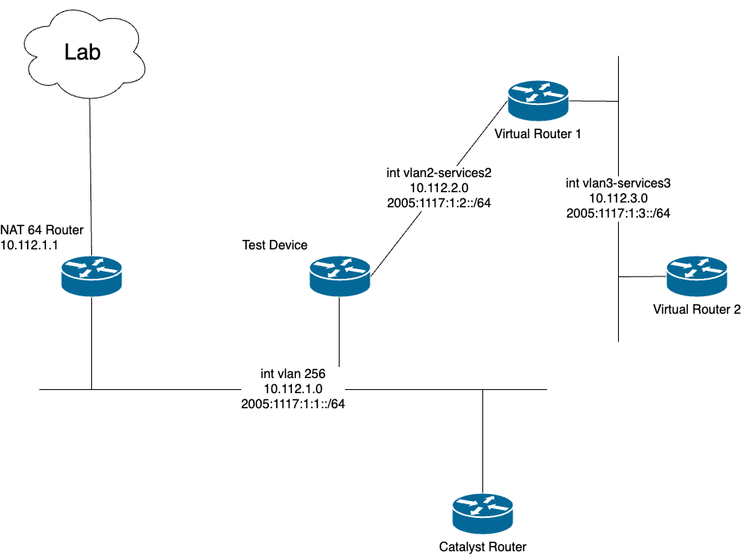

# Cisco_IPv6_Testing
## Objective
Use various protocols in the management, control, and data planes to test Cisco devices with IPv6 addressing. Test multiple devices using a standard set of protocols and document the process. Devices are first tested using IPv4 to establish a baseline of expected results. 
### Network Topology

## Devices
Catalyst 8000v (IOS XE)

Catalyst 9300 (IOS XE)

Catalyst 9800 WLC

Catalyst 9100 APs

Nexus 9000 (NX OS)

Cisco FTDv 

Cisco FMCv
## Management Plane
### Ping (Request/Reply)
Request: Pinged devices on the same subnet and devices on seperate subnets with five 100 byte packets. All tests completed successfully.

Reply: Pinged this device using devices on the same subnet and devices on seperate subnets with five 100 byte packets. All tests completed 
succcessfully.

| Device  |  Request  |  Reply  |
| :-------: | :-------: | :----------: |
| Catalyst 8000v| ✓ | ✓ |
| Catalyst 9300  |         |            |
| Catalyst 9800 WLC |  |  |
| Catalyst 9100 AP |  |  |
| Nexus 9000 |  |  |
| Cisco FTDv |  |  |
| Cisco FMCv |  |  |
### Telnet (Server/Client)
Server: Used device as a telnet server which was virtually connected to by devices outside of the internal network. All tests completed successfully.

Client: Used device to virtually connect to other devices outside of the internal network. All tests completed successfully.

| Device  |  Server  |  Client  |
| :-------: | :-------: | :----------: |
| Catalyst 8000v| ✓ | ✓ |
| Catalyst 9300 |   |   |
| Catalyst 9800 WLC |   |   |
| Catalyst 9100 AP  |   |   |
| Nexus 9000 |      |   |
| Cisco FTDv |      |   |
| Cisco FMCv |      |   |
### SSH (Server/Client)
Server: Used device as an SSH server which was virtually connected to by devices outside of the internal network. All tests completed successfully.

Client: Used device to virtually connect to other devices outside of the internal network. All tests completed successfully.

| Device  |  Server  |  Client  |
| :-------: | :-------: | :----------: |
| Catalyst 8000v| ✓ | ✓ |
| Catalyst 9300 |   |   |
| Catalyst 9800 WLC |   |   |
| Catalyst 9100 AP  |   |   |
| Nexus 9000 |      |   |
| Cisco FTDv |      |   |
| Cisco FMCv |      |   |
### NTP (Server/Client)
Server: Device acted as an stratum level 4 NTP server whose client was a stratum level 5 Endpoint 1. Clock synchronization was successful.

Client: This device used the stratum level 3 NAT 64 Router as a server for clock synchronization. All tests completed successfully.

| Device  |  Server  |  Client  |
| :-------: | :-------: | :----------: |
| Catalyst 8000v| ✓ | ✓ |
| Catalyst 9300 |   |   |
| Catalyst 9800 WLC |   |   |
| Catalyst 9100 AP  |   |   |
| Nexus 9000 |      |   |
| Cisco FTDv |      |   |
| Cisco FMCv |      |   |
## Control Plane
### Static Routes
During set up of each test device, static routes were configured. A default route was configured that hops the NAT64 router and a static route to 2005:1117:1:3::/64 was configured that hops Endpoint 1. Static IPv6 configuration was successful for all devices.
## Data Plane
