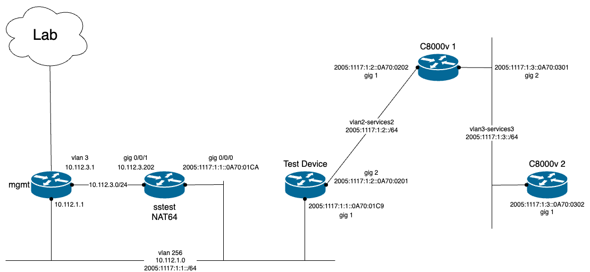

# Cisco_IPv6_Testing
## Objective
Use various protocols in the management, control, and data planes to test Cisco devices with IPv6 addressing. Test multiple devices using a standard set of protocols and document the process. Devices are first tested using IPv4 to establish a baseline of expected results. 
### Network Diagram

## Devices
Catalyst 8000v (IOS XE)

Catalyst 9300 (IOS XE)

Catalyst 9800 WLC

Catalyst 9100 APs

Nexus 9000 (NX OS)

Cisco FTDv 

Cisco FMCv
## Management Plane
## Control Plane
## Data Plane
